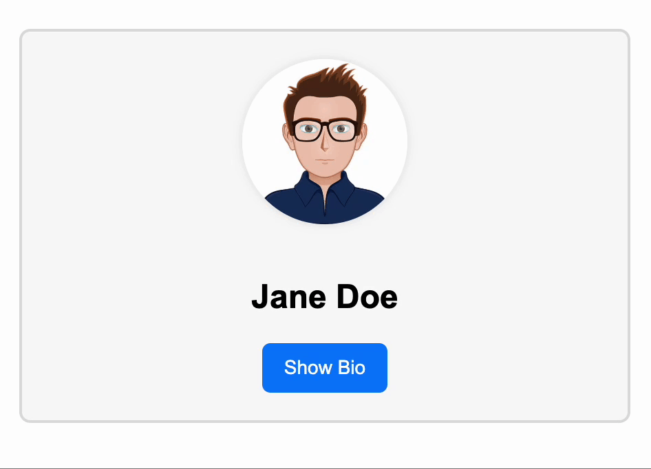

# Requirements breakup

## Problem statement description

- In this task, you are asked to create a **User Profile component** that displays user image, name and button to toggle visibility of user bio

## Features

1. Display the user's profile image in a circular frame at the top of the component.
2. Show the user's full name prominently below the profile image.
3. Include a button labeled "Show Bio" or "Hide Bio" to toggle the visibility of the user's bio.
4. When the bio is visible, display a short description or bio of the user below the button.
5. The toggle button should update its label based on the current state (show/hide bio).
6. The component should be centered and visually appealing, with appropriate spacing and alignment.
7. Use a card-like container with a subtle border and rounded corners for the profile.
8. Ensure accessibility: the button should be keyboard accessible and have appropriate aria-labels.
9. Responsive design: the component should look good on both desktop and mobile screens.
10. Use a default avatar image if no user image is provided.
11. Support for emoji or icons in the bio (e.g., coffee cup emoji).

## Reference UI / Expected Outcome

